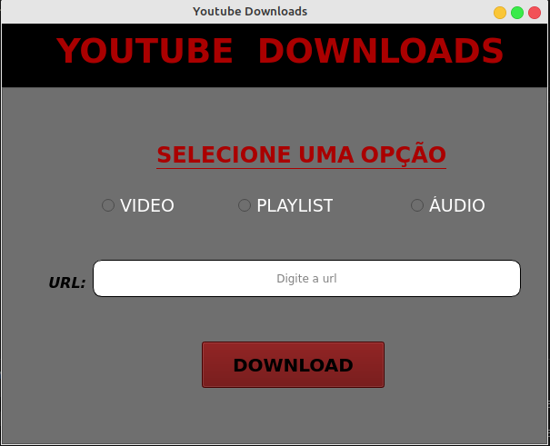
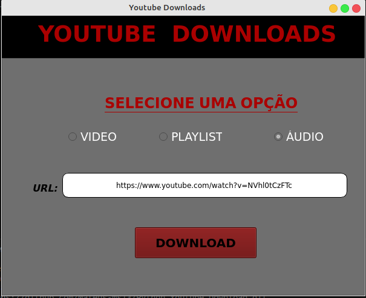
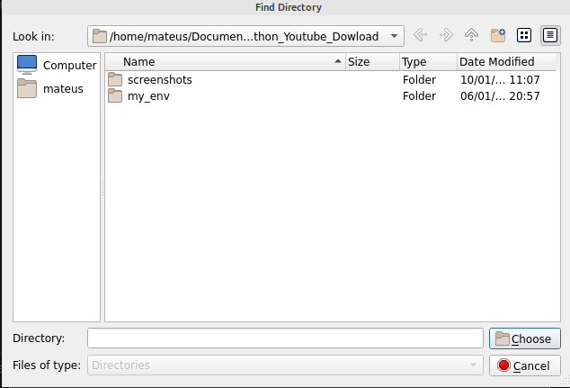

# YOUTUBE DOWNLOADS

Este sistema faz Downloads de vídeos, playlists e áudio que estão disponíveis na plataforma do youtube.

## Objetivo

Este programa tem como objetivo ser uma ferramenta prática para dar praticidade quando queremos baixar algum arquivo do youtube, para assistirmos offline.

## Tecnologias

`Obs: É necessário ter um ambiente de desenvolvimento Python instalado em sua máquina.`

- [Python 3.8](https://www.python.org/downloads/)

- [VsCode](https://code.visualstudio.com/download)

- [Biblioteca PyQt5](https://pypi.org/project/PyQt5/)

- [Biblioteca Pytube 10.4.1](https://pypi.org/project/pytube/)

- [Biblioteca Pytube3 9.6.4](https://pypi.org/project/pytube3/)

## Screenshots

## Licença

Este projeto está sob a licença MIT.

## Autor

Mateus Souza de Jesus, formado em Analise e Desenvolvimento de Sistemas, pelo Centro Universitário Leonardo da Vinci. Estudo a linguagem Python, e também ciência de dados.
